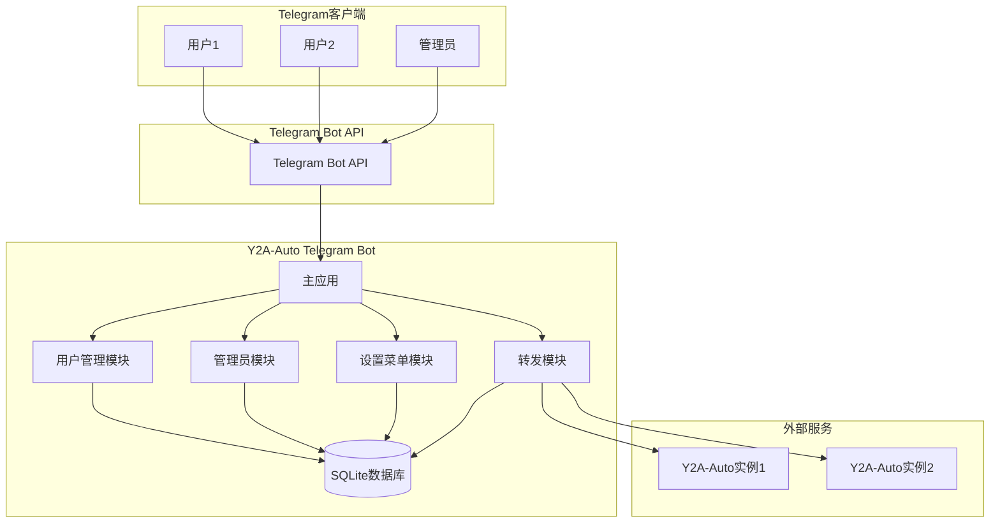
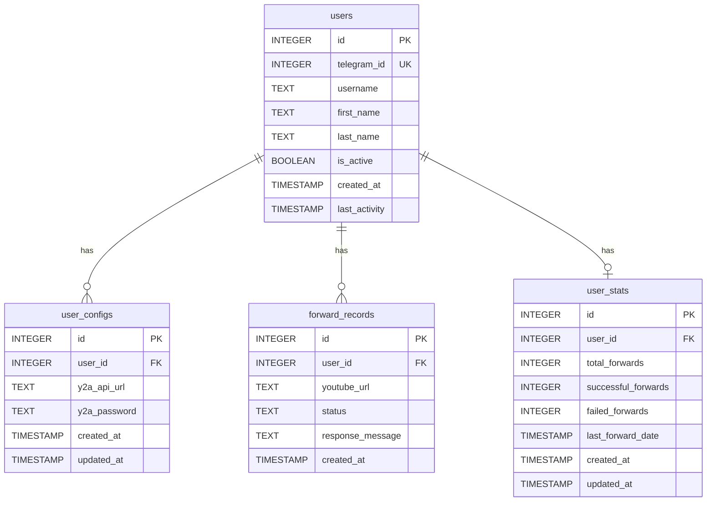

# Y2A-Auto Telegram Bot 多用户架构设计

## 1. 系统概述

### 1.1 目标
将现有的单用户Telegram机器人重构为多用户服务，支持：
- 用户独立配置和管理Y2A-Auto服务
- 管理员查看用户信息和用量统计
- 清晰易读的项目结构，具有高度可维护性

### 1.2 技术栈
- 编程语言：Python 3.11+
- 框架：python-telegram-bot v20.7
- 数据库：SQLite
- 部署：Docker & Docker Compose

## 2. 系统架构

### 2.1 整体架构图



### 2.2 模块划分

#### 2.2.1 主应用模块 (app.py)
- 负责初始化和启动Telegram Bot
- 注册命令处理器和消息处理器
- 协调各模块之间的交互

#### 2.2.2 用户管理模块 (user_manager.py)
- 用户注册和认证
- 用户配置管理
- 用户会话管理

#### 2.2.3 管理员模块 (admin_manager.py)
- 管理员权限验证
- 用户列表查询
- 用户统计信息查询

#### 2.2.4 设置菜单模块 (settings_manager.py)
- 处理/settings命令
- 管理用户Y2A-Auto配置
- 提供交互式设置界面

#### 2.2.5 转发模块 (forward_manager.py)
- YouTube链接验证
- 链接转发到用户配置的Y2A-Auto实例
- 转发结果处理和反馈

#### 2.2.6 数据库模块 (database.py)
- 数据库连接管理
- 数据模型定义
- 数据操作接口

## 3. 数据库设计

### 3.1 数据库表结构

#### 3.1.1 用户表 (users)
```sql
CREATE TABLE users (
    id INTEGER PRIMARY KEY AUTOINCREMENT,
    telegram_id INTEGER UNIQUE NOT NULL,
    username TEXT,
    first_name TEXT,
    last_name TEXT,
    is_active BOOLEAN DEFAULT 1,
    created_at TIMESTAMP DEFAULT CURRENT_TIMESTAMP,
    last_activity TIMESTAMP DEFAULT CURRENT_TIMESTAMP
);
```

#### 3.1.2 用户配置表 (user_configs)
```sql
CREATE TABLE user_configs (
    id INTEGER PRIMARY KEY AUTOINCREMENT,
    user_id INTEGER NOT NULL,
    y2a_api_url TEXT NOT NULL,
    y2a_password TEXT,
    created_at TIMESTAMP DEFAULT CURRENT_TIMESTAMP,
    updated_at TIMESTAMP DEFAULT CURRENT_TIMESTAMP,
    FOREIGN KEY (user_id) REFERENCES users(id) ON DELETE CASCADE
);
```

#### 3.1.3 转发记录表 (forward_records)
```sql
CREATE TABLE forward_records (
    id INTEGER PRIMARY KEY AUTOINCREMENT,
    user_id INTEGER NOT NULL,
    youtube_url TEXT NOT NULL,
    status TEXT NOT NULL, -- 'success', 'failed', 'pending'
    response_message TEXT,
    created_at TIMESTAMP DEFAULT CURRENT_TIMESTAMP,
    FOREIGN KEY (user_id) REFERENCES users(id) ON DELETE CASCADE
);
```

#### 3.1.4 用户统计表 (user_stats)
```sql
CREATE TABLE user_stats (
    id INTEGER PRIMARY KEY AUTOINCREMENT,
    user_id INTEGER UNIQUE NOT NULL,
    total_forwards INTEGER DEFAULT 0,
    successful_forwards INTEGER DEFAULT 0,
    failed_forwards INTEGER DEFAULT 0,
    last_forward_date TIMESTAMP,
    created_at TIMESTAMP DEFAULT CURRENT_TIMESTAMP,
    updated_at TIMESTAMP DEFAULT CURRENT_TIMESTAMP,
    FOREIGN KEY (user_id) REFERENCES users(id) ON DELETE CASCADE
);
```

### 3.2 数据库关系图



## 4. 功能设计

### 4.1 用户功能

#### 4.1.1 用户注册
- 用户首次发送消息时自动注册
- 记录用户基本信息（Telegram ID、用户名、姓名等）

#### 4.1.2 设置菜单 (/settings)
- 交互式菜单界面
- 配置Y2A-Auto API地址
- 配置Y2A-Auto密码（可选）
- 查看当前配置
- 测试配置连接

#### 4.1.3 链接转发
- 自动识别YouTube链接
- 转发到用户配置的Y2A-Auto实例
- 处理认证和错误情况
- 提供转发结果反馈

### 4.2 管理员功能

#### 4.2.1 管理员权限
- 通过环境变量 `ADMIN_TELEGRAM_IDS` 设置管理员用户ID列表
- 管理员命令以 `/admin` 开头

#### 4.2.2 用户管理 (/admin_users)
- 查看所有用户列表
- 查看用户详细信息
- 查看用户配置
- 查看用户统计信息

#### 4.2.3 系统统计 (/admin_stats)
- 系统总用户数
- 活跃用户数
- 总转发次数
- 成功/失败转发统计

## 5. 项目目录结构

```
y2a-auto-tgbot/
├── app.py                 # 主应用入口
├── config.py             # 配置管理
├── requirements.txt      # 依赖包列表
├── Dockerfile           # Docker镜像配置
├── docker-compose.yml   # Docker Compose配置
├── README.md            # 项目说明
├── architecture_design.md # 架构设计文档
│
├── src/                 # 源代码目录
│   ├── __init__.py
│   │
│   ├── database/        # 数据库相关
│   │   ├── __init__.py
│   │   ├── models.py   # 数据模型
│   │   ├── db.py       # 数据库连接和操作
│   │   └── migrations/ # 数据库迁移脚本
│   │       └── 001_initial.py
│   │
│   ├── managers/        # 业务逻辑管理器
│   │   ├── __init__.py
│   │   ├── user_manager.py      # 用户管理
│   │   ├── admin_manager.py     # 管理员功能
│   │   ├── settings_manager.py  # 设置菜单
│   │   └── forward_manager.py   # 链接转发
│   │
│   ├── handlers/        # 消息处理器
│   │   ├── __init__.py
│   │   ├── command_handlers.py  # 命令处理器
│   │   └── message_handlers.py # 消息处理器
│   │
│   ├── utils/           # 工具函数
│   │   ├── __init__.py
│   │   ├── validators.py       # 验证器
│   │   ├── formatters.py       # 格式化工具
│   │   └── helpers.py         # 辅助函数
│   │
│   └── services/        # 外部服务接口
│       ├── __init__.py
│       └── y2a_service.py      # Y2A-Auto服务接口
│
├── data/               # 数据目录
│   ├── app.db          # SQLite数据库文件
│   └── logs/           # 日志目录
│       └── app.log     # 应用日志
│
└── tests/              # 测试目录
    ├── __init__.py
    ├── test_database.py
    ├── test_managers.py
    └── test_handlers.py
```

## 6. 安全考虑

### 6.1 数据安全
- 用户密码加密存储
- 敏感信息不在日志中记录
- 数据库文件访问权限控制

### 6.2 API安全
- Y2A-Auto API地址验证
- 请求超时设置
- 错误处理和重试机制

### 6.3 权限控制
- 管理员权限验证
- 用户只能访问自己的配置和数据
- 命令访问权限控制

## 7. 性能优化

### 7.1 数据库优化
- 适当的索引设计
- 定期清理过期数据
- 数据库连接池

### 7.2 缓存策略
- 用户配置缓存
- 会话状态缓存
- API响应缓存

### 7.3 并发处理
- 异步处理用户请求
- 限制并发API调用
- 队列处理大量请求

## 8. 部署和运维

### 8.1 Docker部署
- 多阶段构建优化镜像大小
- 环境变量配置
- 数据持久化

### 8.2 监控和日志
- 结构化日志记录
- 错误监控和报警
- 性能指标收集

### 8.3 备份和恢复
- 数据库定期备份
- 配置文件备份
- 灾难恢复计划